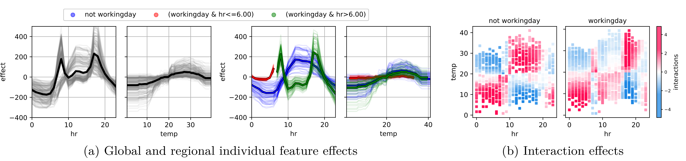
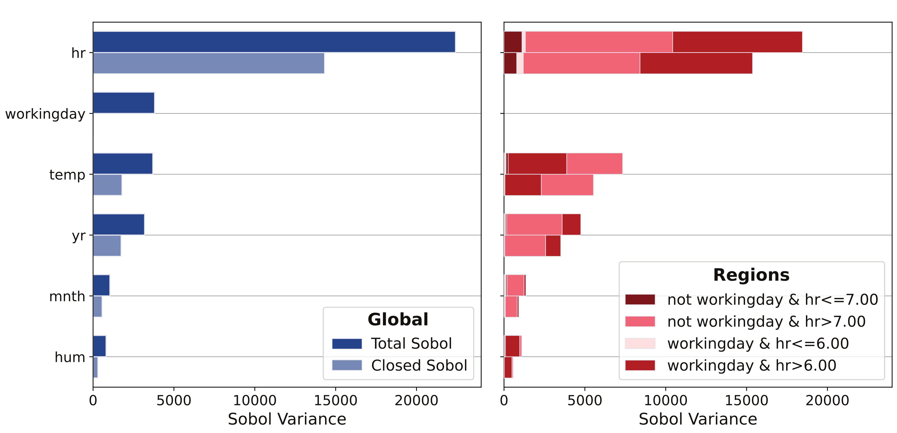
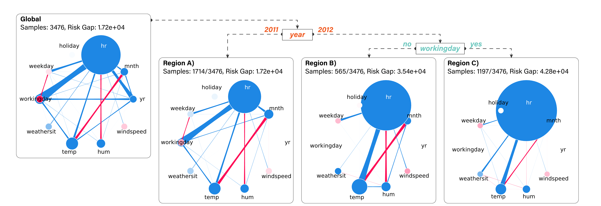

# 🧱 Overview

**GRANITE** (**G**eneralized **R**egional fr**A**mework for ide**N**tIfying agreemen**T** in 
feature-based **E**xplanations) is a methodology that allows practitionners to reduce disagreements
between post-hoc explanations that are arise due to feature **interactions** and **correlations**.
By partitioning the input space into well-chosen rule-based regions, and restricting the data distribution
to said regions when computing explanations, it becomes possible to attain agreement between various
post-hoc explanations methods.

The method supports different kinds of post-hoc explainers.

## Explanations of Local Predictions

- Partial Dependence Plot (PDP)
- Individual Conditional Expectations (ICE)
- Shapley Values (Interventional and Conditional SHAP)

<div style="text-align: center;">
  
</div>

## Sensitivity-based Feature Importance
- Closed Sobol Index
- Total Sobol Index

<div style="text-align: center;">
  
</div>

## Risk-based Feature Importance
- SAGE
- Permutation Feature Importance
- Conditional Feature Importance

<div style="text-align: center;">
  
</div>

# ⚒️ Installation

We recommend creating a virtual environement before installing the source code along its dependencies.
With `conda` do
```bash
conda create -n GRANITE python=3.13
conda activate GRANITE
```

To install the code, run the following command from the project root.

```bash
python3 -m pip install -e .
```

# 🧪 Experiments

The experiments folder is structured as follows
<pre>
.
├── introduction
│   ├── intro_data.py   # Generate regional explanations
│   └── intro_plot.py   # Aggregate the explanations to make Figure 1.
├── notebooks
│   ├── toy_example.ipynb         # Toy example from Figure 1 in more depth.
│   ├── toy_interactions.ipynb    # Toy examples with feature interactions and joint effects
│   ├── bikesharing-global.ipynb  # Regional feature importance scores on Bikesharing
│   ├── bikesharing-local.ipynb   # Regional explanations of local predictions on Bikesharing
│   ├── kin8nm-local.ipynb        # Analysis in Appendix E.2
│   └── diabetes-example.ipynb    # Analysis in Appendix E.3
├── benchmark
│   ├── 1_train_model.py          # Train ML models on Tabular data
│   ├── 2_train_granite.py        # Fit GRANITE using various losses
│   ├── 3_report_results.py       # Generate data for Table 5
│   ├── script_granite.sh
│   ├── script_train.sh
│   ├── script_clean_up.sh
│   └── utils.py
└── scalability
    ├── run_benchmark.py         # Run the experiments of Appendix C.3
    ├── plot_results.py
    └── utils.py
</pre>

# Citation

This work was published in 2026 at the 29th AISTATS Conference.

<pre>
@inproceedings{herbingergranite,
  title={GRANITE: A Generalized Regional Framework for Identifying Agreement in Feature-Based Explanations},
  author={Herbinger, Julia and Laberge, Gabriel and Muschalik, Maximilian and Pequignot, Yann and Wright, Marvin N and Fumagalli, Fabian},
  booktitle={The 29th International Conference on Artificial Intelligence and Statistics}
}
</pre>